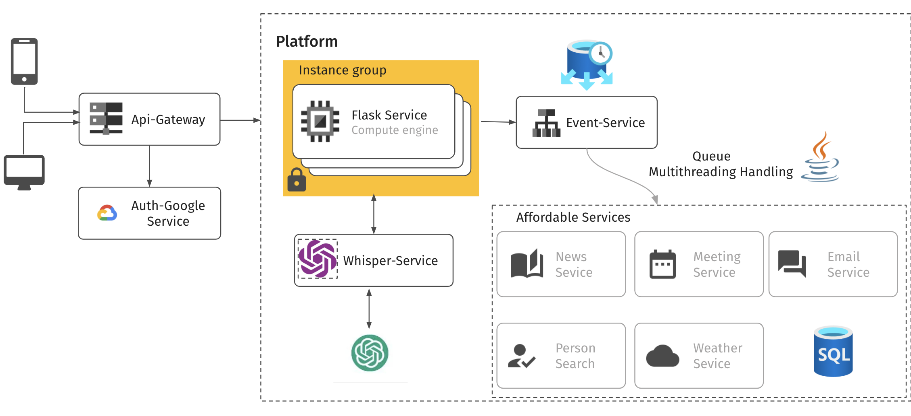

# Detailed WLM System Architecture

This document is a comprehensive guide to the system architecture, representing a microservices approach for a cloud-based platform.

## Components

### API Gateway

The API Gateway acts as the orchestrator of the entire system, directing incoming traffic to the appropriate services and managing cross-cutting concerns.

#### Responsibilities

- **Routing**: Directs incoming requests to the correct backend service.
- **Security**: Implements OAuth and API keys to secure endpoints.
- **Monitoring**: Logs requests and responses to track system usage and issues.
- **Performance**: Adds response caching to improve load times for frequently requested resources.

### Auth-Google Service

The Auth-Google Service is the security checkpoint of the system, leveraging Google's authentication infrastructure to verify user identities.

#### Features

- **Single Sign-On (SSO)**: Provides a seamless login experience using Google accounts.
- **Token Management**: Issues and validates JWT tokens for secure communication between services.
- **User Management**: Manages user sessions and security policies.

### Flask Service (Compute Engine)

A pivotal component that serves as the backbone of the application logic, encapsulated within a scalable cloud infrastructure.

##### Core Functions

- **API Provisioning**: Provides a RESTful API to client applications, serving as a conduit for interactions between the frontend and backend.
- **Data Processing**: Manages complex algorithms and business logic, ensuring data is processed, transformed, and relayed accurately.
- **Service Communication**: Facilitates communication with internal APIs, orchestrating interactions among various microservices.

##### Voice Processing Workflow

- **Voice to Text Conversion**: Integrates with the Whisper-Service to transcribe voice audio from the frontend into text, leveraging advanced audio processing technologies.

- **Text Categorization with ChatGPT**: Forwards the transcribed text to a service akin to ChatGPT for categorization or analysis, utilizing natural language processing to understand and act on user queries.

- **Event Creation and Distribution**: Post-analysis, it engages with the Event-Service to create and dispatch events that correspond to the processed text, streamlining the workflow for subsequent actions.

##### Interaction with Other Services

- **Directing to Targeted Services**: Based on the event categorization, the Event-Service orchestrates the delegation of tasks to specialized services, ensuring that each request is handled by the most suitable microservice.

- **Asynchronous Handling**: Embraces asynchronous task management via queues, allowing for non-blocking operations and efficient use of resources.

##### Scalability and Performance

- **Load Management**: Operates within an Instance Group to dynamically scale with demand, maintaining performance even under varying loads.

- **Efficiency**: By allocating specific tasks to dedicated services, the Flask Service ensures optimal efficiency, concentrating on API delivery and preliminary data handling.

This detailed workflow underscores the Flask Service's critical function in voice data processing and its pivotal role in facilitating the categorization and event-driven mechanisms within the microservices ecosystem.


### Instance Group

A collection of Flask Service instances, ensuring high availability and load distribution.

##### Scalability

- **Load Balancing**: Distributes incoming traffic across multiple instances to prevent overload.
- **Auto-scaling**: Dynamically adjusts the number of instances according to the load.

#### Whisper-Service

A specialized microservice that potentially deals with private and sensitive operations.

##### Potential Uses

- **Data Encryption**: Safeguards sensitive data using encryption techniques.
- **Audio Processing**: Transcribes or analyzes audio streams if related to voice data.

### Event-Service with Queue Multithreading Handling

Manages asynchronous processing across the system, ensuring that tasks are executed efficiently without overloading the services.

#### Processing

- **Event Management**: Handles event-driven tasks in a non-blocking manner.
- **Queue Management**: Prioritizes and distributes tasks using a queue mechanism.
- **Concurrency**: Utilizes multithreading to process multiple tasks in parallel.

### Affordable Services

A suite of microservices designed to extend the platform's capabilities, providing specialized features.

#### Services Breakdown

- **News Service**: Aggregates and delivers news content.
- **Meeting Service**: Manages meeting scheduling and coordination.
- **Email Service**: Sends and receives emails within the platform.
- **Person Search**: Allows searching for individuals within a database.
- **Weather Service**: Provides real-time weather information and forecasts.

### SQL Database

Serves as the central repository for the platform, offering structured data storage and transaction support.

#### Database Operations

- **CRUD Operations**: Supports Create, Read, Update, and Delete operations.
- **ACID Transactions**: Ensures that database transactions are processed reliably.
- **Data Integrity**: Maintains the consistency and accuracy of the stored data.

## System Workflow

The workflow of the system is designed to maximize efficiency and reliability, following these steps:

1. **Request Initiation**: Users initiate requests through their devices, which are received by the API Gateway.
2. **Authentication**: The Auth-Google Service authenticates the user and issues a token.
3. **Service Routing**: The API Gateway routes the request to the appropriate Flask Service instance.
4. **Task Queuing**: Long-running or deferred tasks are sent to the Event-Service to be queued and processed.
5. **Microservice Functionality**: The Affordable Services provide specialized features on demand.
6. **Data Storage and Retrieval**: All services interact with the SQL Database to store and retrieve persistent data.

By maintaining a clean separation of concerns, each service is able to operate independently, reducing complexity and allowing for individual scaling and maintenance without affecting the entire system.


## Running the Project

To get the system up and running on your local machine or a development server, follow these simple instructions.

### Prerequisites

Ensure you have the following installed:

- [Docker](https://www.docker.com/get-started): To create containers for each microservice.
- [Docker Compose](https://docs.docker.com/compose/install/): To manage the multi-container setup with ease.

### Instructions

1. **Clone the Project Repository**: Obtain a copy of the project source code on your local machine.

   ```bash
   git clone <repository-url>
   cd <project-directory>
    ```
   
2. **Build the Docker Containers**: Use Docker Compose to build the required containers.
    ```bash
    docker-compose up -d
    ```
3. **Verify the Setup**: Check if the containers are running and healthy.
    ```bash
    docker-compose ps
    ```